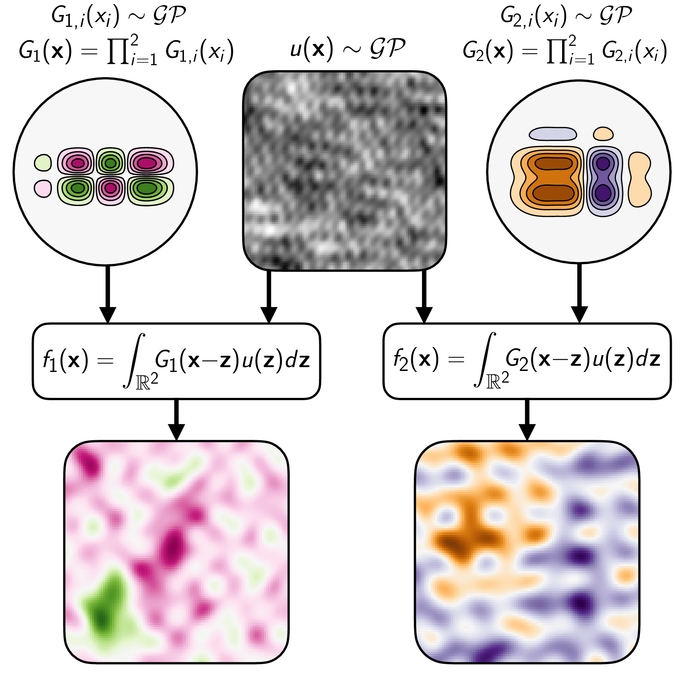

# Shallow and Deep Nonparametric Convolutions for Gaussian Processes

This repository contains PyTorch implementations of the nonparametric convolved Gaussian process (NP-CGP) and nonparametric deep Gaussian process (NP-DGP) outlined in the paper, *Shallow and Deep Nonparametric Convolutions for Gaussian Processes*.



## Setup & Requirements
To install, create a fresh Python 3.9 conda environment and run `pip install -e .` from root directory. Running `setup.py` this way will work fine with most GPUs (inc. NVIDIA V100s), but to use NVIDIA A100s, you must also load `cuda==11.1.1` and run the following:

`pip install torch==1.9.1+cu111 -f https://download.pytorch.org/whl/torch_stable.html`

## Training
Use the following command to run one of the shallow UCI experiments from the paper:

`python bin/experiments/uci.py --time 1000 --verbosity 100 --n_iter 40000 --uci_name energy --output_dir jobs/energy --batch_size 1000 --num_layers 1 --dry_run`

The `dry_run` argument allows the model to be trained without Weights & Biases monitoring.

## Citation
```
TODO
```
